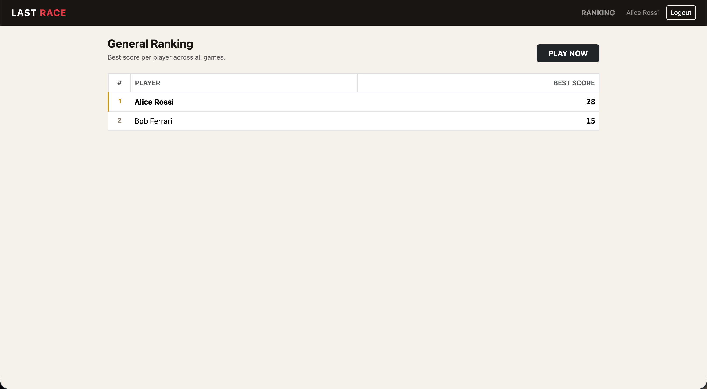
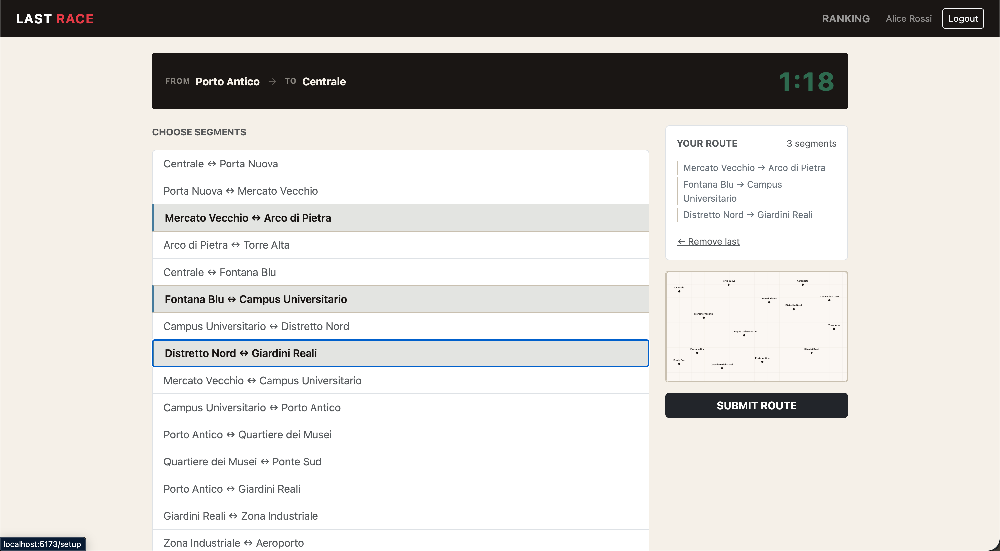

# Exam #1: "Last Race"
## Student: s359996 SADIKHOV ELVIN

## React Client Application Routes

- Route `/`: login page; shows game instructions and sign-in form; redirects to `/setup` if already authenticated
- Route `/setup`: setup page; shows the full metro network map so the player can study it before the race; authenticated only
- Route `/game/:id/planning`: planning page; shows only stations (lines hidden), start/destination, segment list, 90-second countdown; player builds route then submits; authenticated only
- Route `/game/:id/execution`: execution page; reveals route steps one by one with random events and coin effects; shows final score; authenticated only
- Route `/ranking`: ranking page; shows best score per player across all games, sorted descending; authenticated only

## API Server

- POST `/api/sessions`
  - request body: `{ email, password }`
  - response: `{ id, email, name }` (200) or `{ error }` (401/422)

- GET `/api/sessions/current`
  - no parameters
  - response: `{ id, email, name }` (200) or `{ error }` (401)

- DELETE `/api/sessions/current`
  - no parameters; requires authentication
  - response: empty (204)

- GET `/api/network`
  - no parameters
  - response: `{ lines: [{ id, name, color, stations: [{ id, name }] }], stations: [{ id, name, lat, lon }] }`

- POST `/api/games`
  - no body; requires authentication
  - response: `{ gameId, startStation: { id, name }, destStation: { id, name } }` (201)

- POST `/api/games/:id/route`
  - request body: `{ segments: [{ from, to }] }`; requires authentication; game must belong to the authenticated user
  - response: `{ valid, steps: [{ fromName, toName, event: { description, effect }, coinsAfter }] | null, finalScore }` (200) or `{ error }` (404/409/422)

- GET `/api/ranking`
  - no parameters; requires authentication
  - response: `[{ userName, bestScore }]` sorted by bestScore descending

## Database Tables

- Table `users` — id, email (unique), name, hash, salt; stores registered players
- Table `lines` — id, name, color; the four metro lines
- Table `stations` — id, name, lat, lon; all network stations
- Table `line_stations` — line_id, station_id, position; ordered membership of stations in each line (composite primary key)
- Table `events` — id, description, effect; random events assigned to segments during execution
- Table `games` — id, user_id, start_station_id, dest_station_id, score (nullable), status (active/completed), created_at; one row per game attempt

## Main React Components

- `LRNavbar` (in `components/Navbar.jsx`): top navigation bar with brand, ranking link, user name, and logout with confirmation modal
- `ProtectedRoute` (in `components/ProtectedRoute.jsx`): wrapper that redirects unauthenticated users to `/`; returns null while session check is in progress to prevent flash
- `MetroMap` (in `components/MetroMap.jsx`): SVG metro map rendered from network data; supports `mode="full"` (lines + stations + interchanges) and `mode="stationsOnly"` (dots only, no line colours)
- `LoginPage` (in `pages/LoginPage.jsx`): sign-in form with game phase summary on the left
- `SetupPage` (in `pages/SetupPage.jsx`): full metro map with "Start Planning" button
- `PlanningPage` (in `pages/PlanningPage.jsx`): segment selection list, route builder panel, map thumbnail, countdown timer, submit button
- `ExecutionPage` (in `pages/ExecutionPage.jsx`): step-by-step reveal of route segments with events and coin totals; final score card
- `RankingPage` (in `pages/RankingPage.jsx`): leaderboard table with medal colours and current user highlighted

## Screenshot

## Users Credentials

- alice@lastrace.com, alice123
- bob@lastrace.com, bob456
- carol@lastrace.com, carol789

## Use of AI Tools

I used Claude to look up some Node.js specifics I wasn't sure about — mainly how `crypto.scrypt` works and what `timingSafeEqual` does and why it matters. I also asked it to clarify some React hook behaviour I was confused about while implementing the countdown timer. All of that I verified against the official docs and by testing the actual behaviour myself.

For content that didn't affect logic, I used it to generate the station names and the in-game event descriptions, since those are just flavour text and I didn't want to spend time on them.

All design decisions, architecture, and code were done by me.

